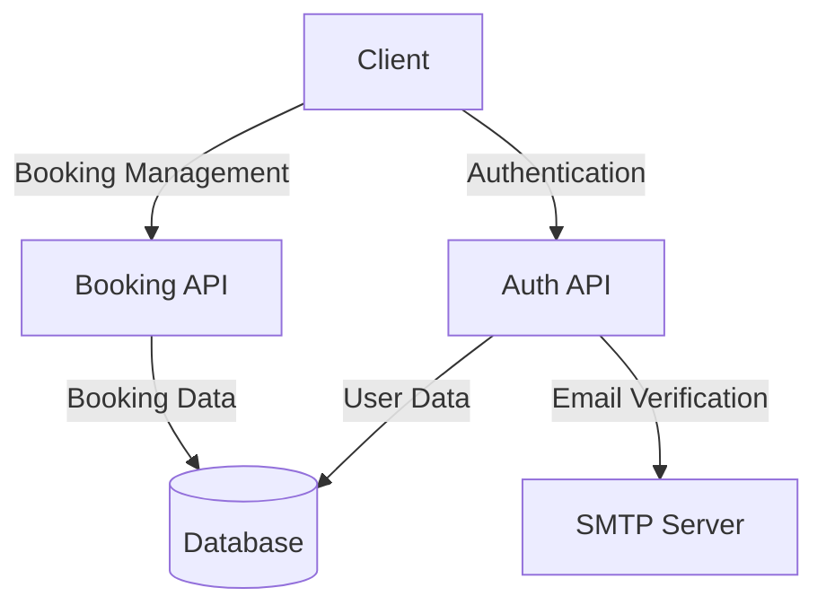
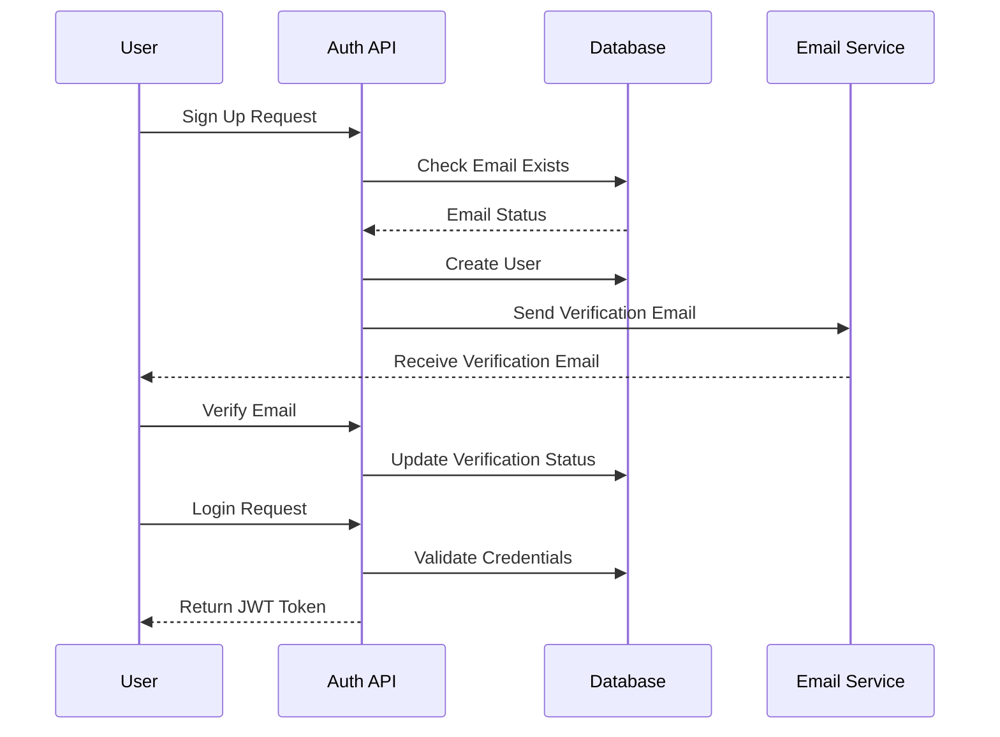
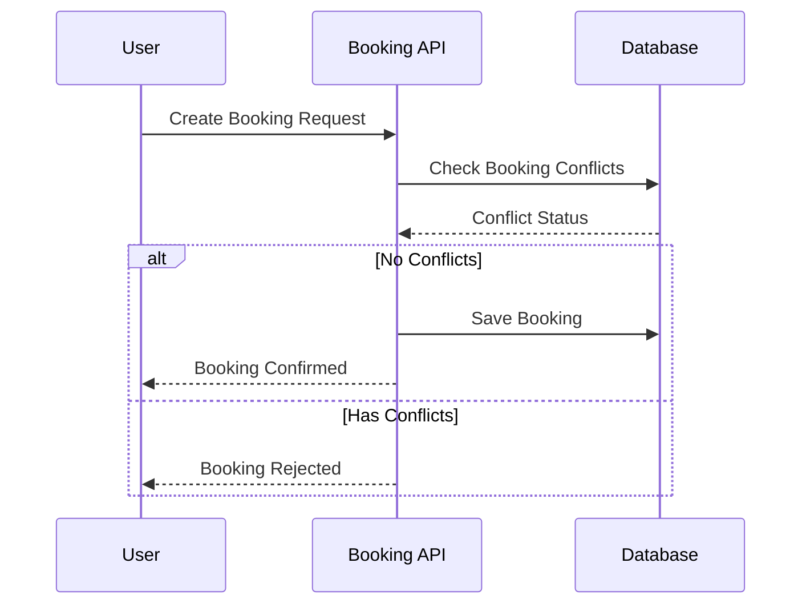

# Booking System API Documentation

## System Architecture


## Authentication Flow


## Booking Flow


## API Endpoints

### Authentication API

#### 1. Sign Up
- **Endpoint**: `POST /api/auth/signup`
- **Description**: Register a new user
- **Request Body**:
  ```json
  {
    "firstName": "string",
    "lastName": "string",
    "email": "string",
    "password": "string"
  }
  ```
- **Response**: 
  ```json
  {
    "message": "User created successfully",
    "userId": "number"
  }
  ```
- **Note**: For testing purposes, email verification is automatically completed.

#### 2. Login
- **Endpoint**: `POST /api/auth/login`
- **Description**: Authenticate user and get JWT token
- **Request Body**:
  ```json
  {
    "email": "string",
    "password": "string"
  }
  ```
- **Response**:
  ```json
  {
    "token": "string",
    "user": {
      "id": "number",
      "firstName": "string",
      "lastName": "string",
      "email": "string"
    }
  }
  ```

### Booking API

#### 1. Create Booking
- **Endpoint**: `POST /api/bookings`
- **Authentication**: Required (JWT Token)
- **Description**: Create a new booking
- **Request Body**:
  ```json
  {
    "customerName": "string",
    "customerEmail": "string",
    "bookingDate": "YYYY-MM-DD",
    "bookingType": "Full Day | Half Day | Custom",
    "bookingSlot": "First Half | Second Half", // Required for Half Day bookings
    "bookingTime": "HH:mm" // Required for Custom bookings
  }
  ```
- **Response**:
  ```json
  {
    "message": "Booking created successfully",
    "bookingId": "number"
  }
  ```

#### 2. Get User's Bookings
- **Endpoint**: `GET /api/bookings`
- **Authentication**: Required (JWT Token)
- **Description**: Retrieve all bookings for the authenticated user
- **Response**:
  ```json
  [
    {
      "id": "number",
      "customer_name": "string",
      "customer_email": "string",
      "booking_date": "YYYY-MM-DD",
      "booking_type": "Full Day | Half Day | Custom",
      "booking_slot": "First Half | Second Half | null",
      "booking_time": "HH:mm | null",
      "created_at": "timestamp"
    }
  ]
  ```

## Booking Rules

1. **Full Day Booking**:
   - Blocks the entire day
   - Cannot be booked if any other booking exists for that day

2. **Half Day Booking**:
   - Can be either "First Half" or "Second Half"
   - Cannot be booked if:
     - A Full Day booking exists for that day
     - Another Half Day booking exists for the same slot

3. **Custom Booking**:
   - Requires specific time slot
   - Cannot be booked if:
     - A Full Day booking exists for that day
     - A Half Day booking exists that overlaps with the time
     - Another Custom booking exists at the same time

## Error Responses

All endpoints may return the following error responses:

```json
{
  "error": "Error message description"
}
```

Common HTTP Status Codes:
- 400: Bad Request (invalid input)
- 401: Unauthorized (invalid/missing token)
- 409: Conflict (booking slot not available)
- 500: Internal Server Error

## Authentication

- All booking endpoints require a valid JWT token
- Token should be included in the Authorization header:
  ```
  Authorization: Bearer <token>
  ```

## Testing

A test script (`test-api.js`) is provided to verify the API functionality. It tests:
1. User signup
2. User login
3. Booking creation
4. Booking conflict detection
5. Retrieving user's bookings
